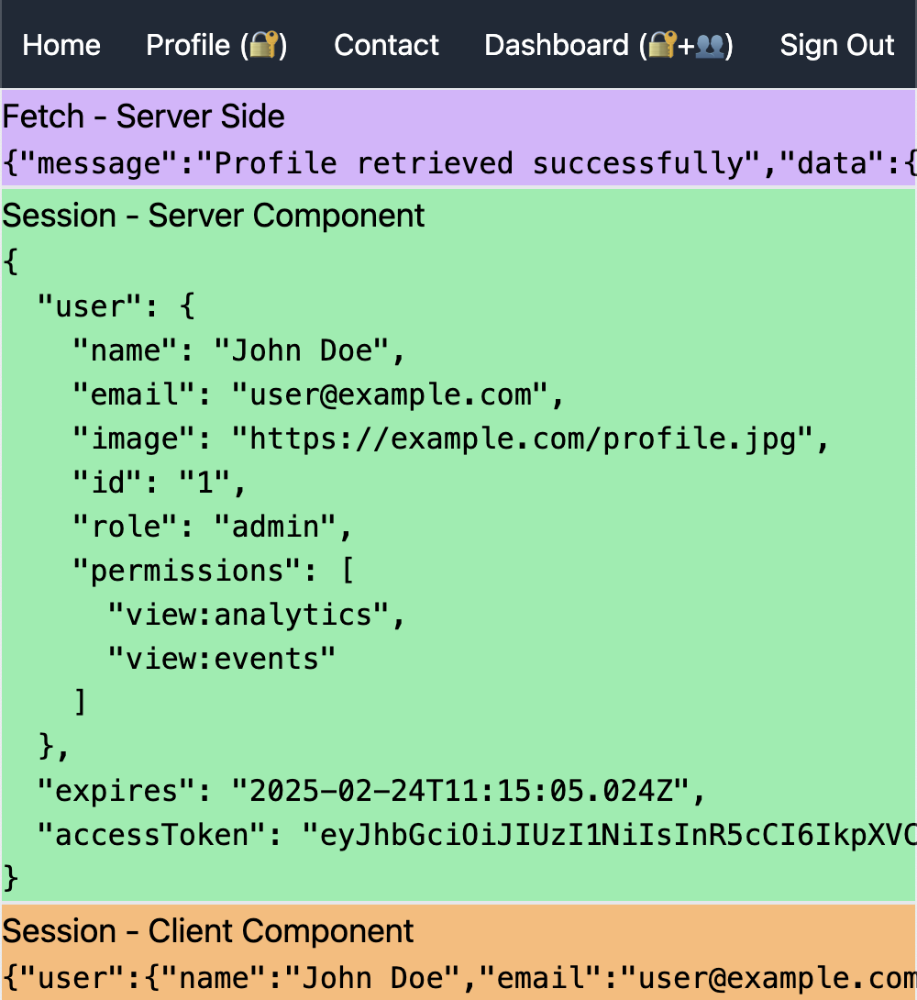

# Auth.js-er-14-Gushti: A-Z of Auth.js Authentication Solution

<p align="center">
    
</p>

## Description

Auth.js authentication solution for NextJS, delivering comprehensive security and seamless backend integration.

## Features

- Credential-based authentication
- JWT token management
- Dynamic route protection
- Automatic token refresh
- Server & client-side session handling

## Installation

1. Clone the repository

   ```bash
   https://github.com/shahriarshafin/authjs-er-14-gushti.git
   ```

2. Change the working directory

   ```bash
   cd authjs-er-14-gushti
   ```

3. Install dependencies

   ```bash
   npm install # or, yarn install
   ```

4. Create .env

   > Create a `.env` file similar to `.env.example`

5. Run the app in development mode
   ```bash
   npm run dev # or, yarn dev
   ```

That's All! Now open [localhost:3000](http://localhost:3000/) to see the app.

## Authentication Flow

Credential Submission → Backend Validation → Token Generation → Secure Session → Route Protection

## Key Components

Auth Middleware, JWT Session, Token Refresh, Route Protection

## Route Protection

Server-side Checks, Middleware Filtering, Role-based Control

## Security

Secure Tokens, Auto Refresh, Backend Integration, Error Handling

## License

[MIT License](LICENSE)
